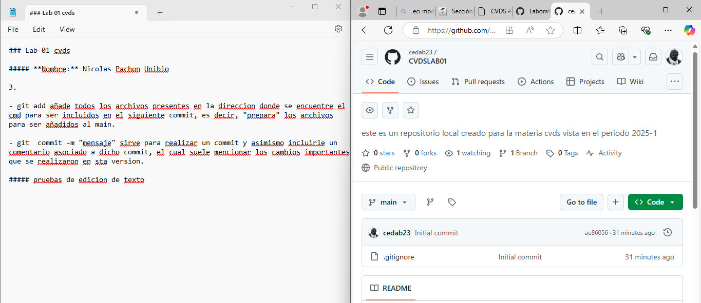
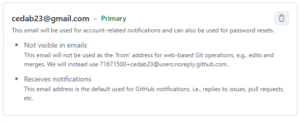

### Lab 01 cvds

##### **Nombre:** Nicolas Pachon Unibio

**3)** 

- git add añade todos los archivos presentes en la direccion donde se encuentre el cmd para ser incluidos en el siguiente commit, es decir, "prepara" los archivos para ser añadidos al main.

- git  commit -m "mensaje" sirve para realizar un commit y asimismo incluirle un comentario asociado a dicho commit, el cual suele mencionar los cambios importantes que se realizaron en sta version.

##### Pruebas de edicion de texto:

#### Email asociado a la cuenta de GitHub:

